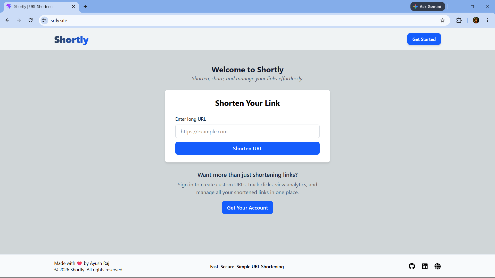
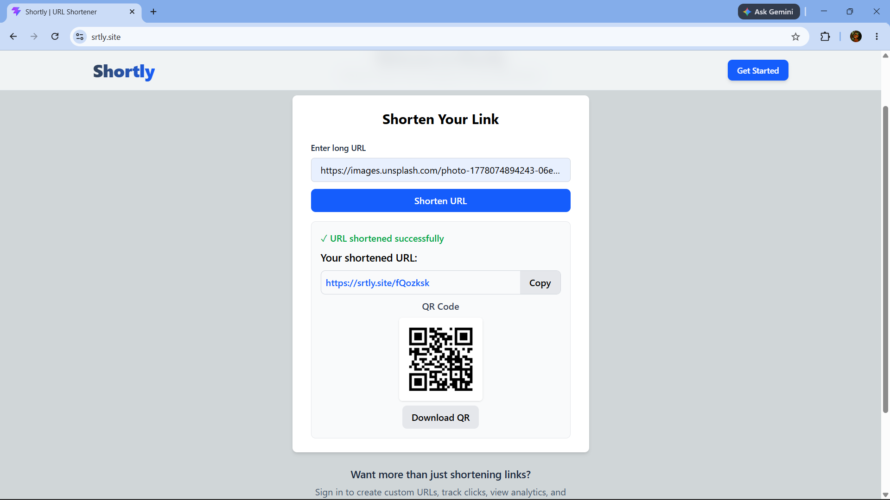
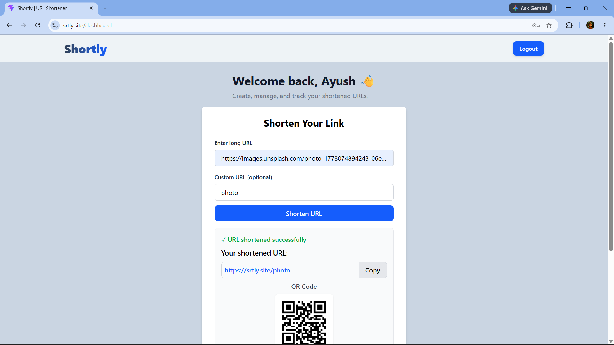
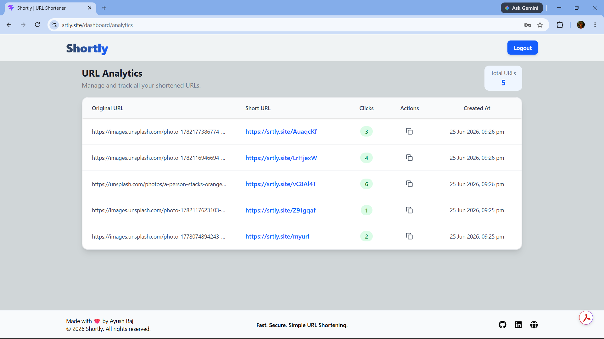
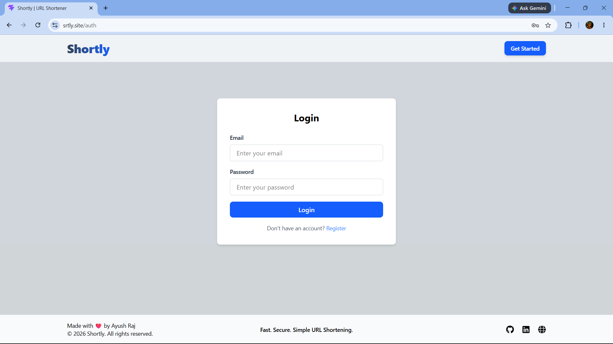

# 🔗 Shortly

> A modern full-stack URL shortener that lets users create, customize, and manage short links with built-in analytics and QR code generation.

Shortly is a full-stack URL shortening platform built with the MERN stack. It allows anyone to generate short URLs instantly, while authenticated users can create custom aliases, manage all their links from a personalized dashboard, and track click analytics in real time.

The project demonstrates authentication, REST APIs, protected routes, state management, secure cookie-based sessions, and responsive frontend development in a production-style application.

---

## 🚀 Live Demo

**Frontend:** https://www.srtly.site

**Backend API:** https://api.srtly.site

---

# 📸 Screenshots

### Landing Page



### Generated Short URL



### Dashboard



### Analytics



### Authentication



---

# ✨ Features

### URL Shortening

- Generate short URLs instantly
- Redirect users to the original destination
- Copy shortened URLs with one click
- Generate downloadable QR codes

### Authentication

- User Registration & Login
- JWT Authentication
- HTTP-only secure cookies
- Protected dashboard routes

### Custom URLs

Authenticated users can:

- Create custom URL aliases
- Prevent duplicate aliases
- Manage all created links

### Analytics Dashboard

- View all shortened URLs
- Track total clicks
- Copy links instantly
- View creation timestamps
- Clean dashboard interface

### Security

- Password hashing using bcrypt
- JWT authentication
- Protected API routes
- Secure cookie-based sessions
- Centralized error handling

---

# 🛠 Tech Stack

## Frontend

- React 19
- Vite
- Tailwind CSS v4
- React Router v7
- Zustand
- TanStack Query
- Axios
- QRCode

## Backend

- Node.js
- Express.js
- MongoDB
- Mongoose

## Authentication

- JWT
- bcrypt
- HTTP-only Cookies

## Deployment

- Vercel (Frontend)
- Render (Backend)
- MongoDB Atlas

---

# 📂 Project Structure

```
shortly/

├── frontend/
│   ├── src/
│   │   ├── api/
│   │   ├── components/
│   │   ├── layouts/
│   │   ├── pages/
│   │   ├── router/
│   │   ├── store/
│   │   └── utils/
│   └── package.json
│
├── backend/
│   ├── src/
│   │   ├── config/
│   │   ├── controllers/
│   │   ├── middlewares/
│   │   ├── models/
│   │   ├── routes/
│   │   ├── services/
│   │   └── utils/
│   └── package.json
│
└── README.md
```

---

# ⚙️ Installation

## Clone the repository

```bash
git clone https://github.com/ayushraj78088/shortly.git

cd shortly
```

---

## Install Dependencies

### Backend

```bash
cd backend
npm install
```

### Frontend

```bash
cd ../frontend
npm install
```

---

## Environment Variables

### Backend (.env)

```env
PORT=5000

MONGO_URI=your_mongodb_connection_string

ACCESS_TOKEN_SECRET=your_access_token_secret

BASE_URL=http://localhost:5000

FRONTEND_URL=http://localhost:5173
```

### Frontend (.env)

```env
VITE_BACKEND_URL=http://localhost:5000
```

---

## Run the Project

### Backend

```bash
cd backend

npm run dev
```

### Frontend

```bash
cd frontend

npm run dev
```

The application will be available at:

```
Frontend
http://localhost:5173

Backend
http://localhost:5000
```

---

# 📈 Future Improvements

- Edit existing URLs
- Delete URLs
- Search & filter dashboard
- User profile page
- Expiring links
- Password reset
- Dark mode
- Advanced analytics
- Rate limiting
- Docker support

---

# 👨‍💻 Author

**Ayush Raj**

GitHub: https://github.com/ayushraj78088

LinkedIn: https://linkedin.com/in/ayushraj78088

Portfolio: https://ayushraj-dev.vercel.app/

---

_If you like this project, please consider giving it a ⭐ on GitHub!_
